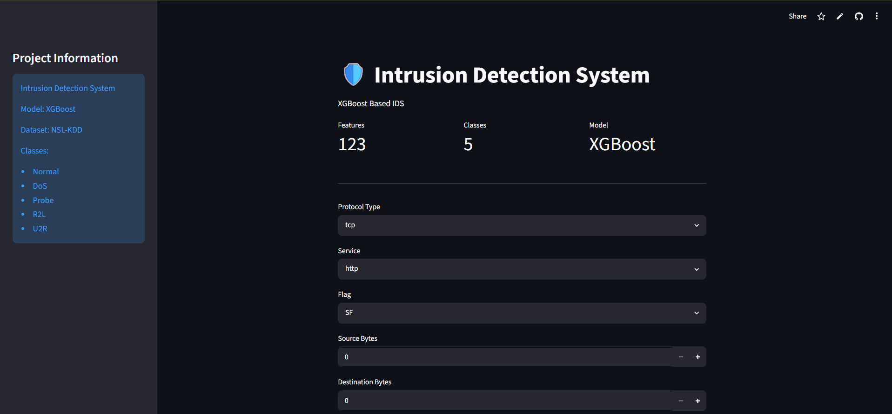
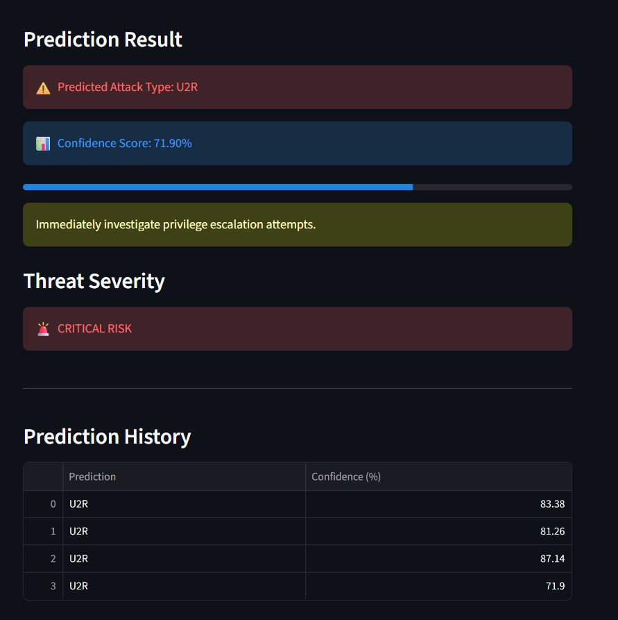
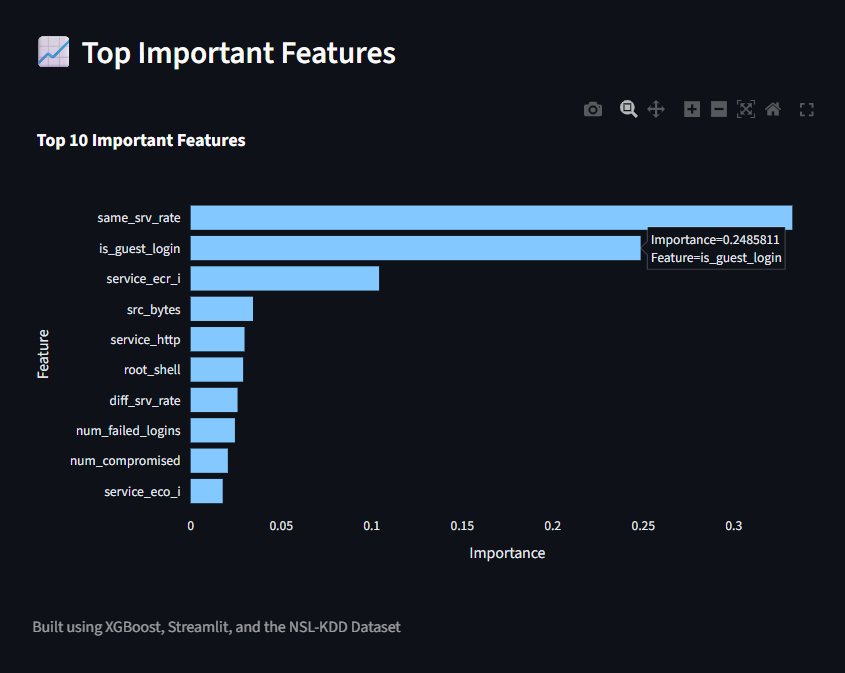

# 🛡️ Intrusion Detection System using XGBoost


---

# 🚀 Project Overview

An AI-powered Intrusion Detection System (IDS) that uses Machine Learning to detect cyber attacks and anomalous network behavior from network traffic data.

The system is trained on the NSL-KDD dataset and uses an XGBoost Classifier to classify network activities into different attack categories.

The project also includes an interactive Streamlit web application for real-time threat prediction and visualization.

---

# 🌐 Live Demo

https://intrusion-detection-systems.streamlit.app

---

# 🎯 Objectives

* Detect malicious network activities
* Classify cyber attacks into multiple categories
* Improve cybersecurity monitoring using Machine Learning
* Provide an interactive web interface for threat prediction
* Visualize important network security features

---

# 🏗️ Project Architecture

```text
NSL-KDD Dataset
       │
       ▼
Data Preprocessing
       │
       ▼
Feature Engineering
       │
       ▼
One-Hot Encoding
       │
       ▼
XGBoost Classifier
       │
       ▼
Model Evaluation
       │
       ▼
Streamlit Deployment
```

---

# 📊 Dataset

Dataset Used: NSL-KDD Dataset

The dataset contains network traffic records labeled as normal behavior or various cyber attacks.

## Attack Categories

| Class  | Description                       |
| ------ | --------------------------------- |
| Normal | Legitimate Network Activity       |
| DoS    | Denial of Service Attack          |
| Probe  | Network Scanning and Surveillance |
| R2L    | Remote to Local Attack            |
| U2R    | User to Root Attack               |

---

# ⚙️ Technologies Used

* Python
* Pandas
* NumPy
* XGBoost
* Scikit-Learn
* Plotly
* Streamlit
* Jupyter Notebook

---

# 🧠 Machine Learning Pipeline

## Data Preprocessing

* Data Cleaning
* Label Encoding
* Feature Selection
* Handling Categorical Variables

## Feature Engineering

* One-Hot Encoding
* Feature Alignment
* Feature Importance Extraction

## Model Training

* XGBoost Classifier
* Train-Test Split
* Hyperparameter Optimization
* Model Evaluation

---

# 📈 Model Performance

## Accuracy

```text
87%
```

## Evaluation Metrics

| Metric    | Score |
| --------- | ----- |
| Accuracy  | 87%   |
| Precision | High  |
| Recall    | High  |
| F1 Score  | High  |

---

# 🔥 Top Important Features

The model identified the following highly influential features:

* same_srv_rate
* is_guest_login
* service_ecr_i
* src_bytes
* service_http
* root_shell
* diff_srv_rate
* num_failed_logins
* num_compromised
* service_eco_i

---

# 🖥️ Streamlit Application

The application allows users to:

✅ Select Protocol Type

✅ Select Service Type

✅ Select Connection Flag

✅ Enter Network Traffic Parameters

✅ Predict Attack Category

✅ View Threat Severity

✅ View Prediction History

✅ Analyze Feature Importance

---

# 📸 Application Screenshots

## 🏠 Home Page



---

## 🚨 Attack Prediction Example



---

## 📊 Feature Importance Analysis



---

# 📂 Project Structure

```text
Intrusion-Detection-System/
│
├── app/
│   └── app.py
│
├── assets/
│   ├── home.png
│   ├── prediction.png
│   └── features.png
│
├── data/
│   ├── KDDTrain+.txt
│   └── KDDTest+.txt
│
├── models/
│   ├── xgboost_ids.pkl
│   ├── label_encoder_xgb.pkl
│   └── feature_columns_xgb.pkl
│
├── notebooks/
│   └── eda.ipynb
│
├── reports/
│   └── feature_importance.csv
│
├── requirements.txt
│
└── README.md
```

---

# ▶️ How to Run

## Clone Repository

```bash
git clone https://github.com/2303A52119/IntrusionDetection-System.git
```

## Move into Project

```bash
cd IntrusionDetection-System
```

## Install Dependencies

```bash
pip install -r requirements.txt
```

## Run Streamlit Application

```bash
cd app
streamlit run app.py
```

---

# 🔮 Future Improvements

* Real-Time Packet Monitoring
* Scapy Integration
* Network Traffic Visualization
* Cloud Deployment on AWS
* Docker Containerization
* Threat Intelligence Integration
* Bulk CSV Prediction
* Deep Learning-Based IDS

---

# 👨‍💻 Author

**Rushik Pujari**

B.Tech Computer Science Engineering (2027)

Interests:

* Artificial Intelligence
* Machine Learning
* Cybersecurity
* Cloud Computing
* Data Science

---

⭐ If you found this project useful, consider giving it a star.
